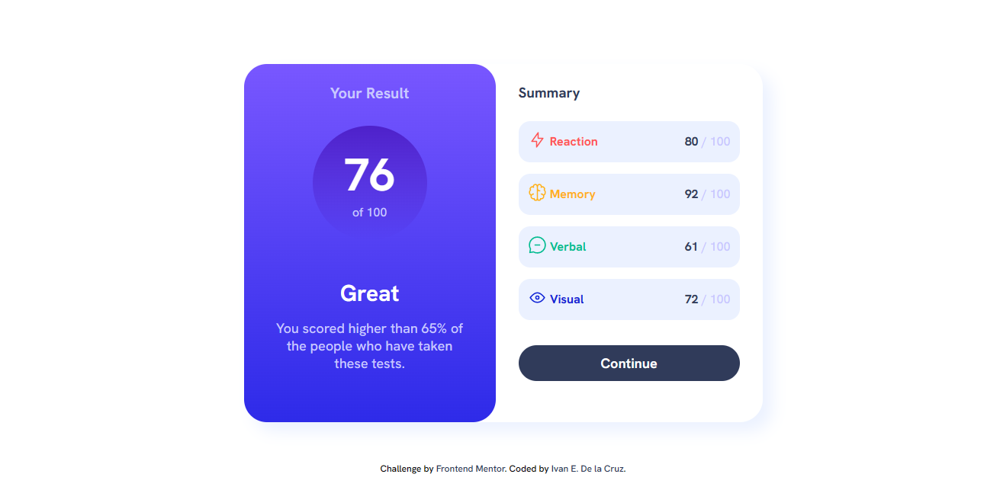

# Frontend Mentor - Results summary component solution

This is a solution to the [Results summary component challenge on Frontend Mentor](https://www.frontendmentor.io/challenges/results-summary-component-CE_K6s0maV). Frontend Mentor challenges help you improve your coding skills by building realistic projects. 

## Table of contents

- [Overview](#overview)
  - [Screenshot](#screenshot)
  - [Links](#links)
- [My process](#my-process)
  - [Built with](#built-with)
  - [What I learned](#what-i-learned)
- [Author](#author)

**Note: Delete this note and update the table of contents based on what sections you keep.**

## Overview

This is a component that displays a summary of the results obtained by x test with their respective percentages.

### Screenshot

### Links

- Solution URL: [Git Hub](https://github.com/IvanEDLCP/Results-summary-component)
- Live Site URL: [Results summary component live site](https://ivanedlcp.github.io/Results-summary-component/)

## My process

### Built with

- HTML5 markup
- CSS custom properties
- Flexbox
- Mobile-first workflow
- BEM methodology

### What I learned

Second challenge in this platform, in which I took the risk to use the div tag and work with the classes using the BEM methodology; I also tried a little drastic modification in the css sentences when adapting the design to desktop since the design has a different composition in this version. I hope to continue testing myself with this type of compositions.

## Author

- Frontend Mentor - [@IvanEDLCP](https://www.frontendmentor.io/profile/IvanEDLCP)